# Dockerイメージの使い方

ROS2とPythonで作って学ぶAIロボット入門（出村・萩原・升谷・タン著，講談社，以下では「この本」と書きます）のためのDockerイメージの使い方を説明します．

## 概要

- Dockerを使ってこの本の教材をすぐに試すことのできるデスクトップ環境を提供します．<span class="col-red">Ubuntu Linuxでは，ハードウェアの利用も可能なのでロボット実機も動かすことができます．Windowsでは，ハードウェアの利用はできないので実機は動きませんが，シミュレーションの実行は可能です．MacOSでも利用できると思われますが，確認していません．</span>
- 提供するDockerのイメージには以下の内容が含まれており，個別のインストールは不要です．
  - Ubuntu 20.04 デスクトップ環境（日本語化済み）
  - テキストエディタ VSCodium
  - ROS Foxy
  - この本の教材に必要なパッケージ・ライブラリ
  - この本のサンプルプログラム
- Dockerイメージの作り方については，この文書では説明しません．[こちらのリポジトリ](https://github.com/AI-Robot-Book/docker-ros2-desktop-ai-robot-book)を見てください．

## 目次

- [Ubuntu Linuxの場合](#ubuntu-linuxの場合)
- [Windowsの場合](#windowsの場合)
- [デスクトップ環境の使い方（共通事項）](#デスクトップ環境の使い方共通事項)
- [ハードウェアの使い方](#ハードウェアの使い方)
- [Windows リモートデスクトップ接続の利用（未完成）](#windows-リモートデスクトップ接続の利用未完成)
- [著者](#著者)
- [履歴](#履歴)
- [参考文献](#参考文献)


## Ubuntu Linuxの場合

### Dockerのインストール

コンピュータがインターネットに接続している状態で，端末ウィンドウに以下を入力します．
```
sudo apt install docker.io
sudo adduser $USER docker
reboot
```

### コンテナの起動

- 利用するコンピュータをインターネットに接続します．
- 起動コマンドが長いので，それを毎回入力しなくて済むようにシェルスクリプトを用意しました．
  - [ここからシェルスクリプトrun.bash](https://raw.githubusercontent.com/AI-Robot-Book/docker-ros2-desktop-ai-robot-book/ai-robot-book/run.bash)をダウンロードします．
  - ダウンロードしたファイルを適当なディレクトリに置きます．
  - 端末ウィンドウを開き，以下を入力して実行します．
    ```
    cd run.bashを置いたディレクトリ
    chmod +x run.bash
    ./run.bash
    ```
- 初めて起動する場合は，DockerHubからイメージ（約10GB）をプル（ダウンロード）するので，かなり時間がかかります．
- イメージのプルが済んだ後に，ずらずらとたくさんの文字が表示され，最後に以下のような内容が表示されたら，コンテナの準備完了です．
  ```
  2022-08-28 16:06:25,549 INFO success: lxpanel entered RUNNING state, process has stayed up for > than 1 seconds (startsecs)
  2022-08-28 16:06:25,549 INFO success: pcmanfm entered RUNNING state, process has stayed up for > than 1 seconds (startsecs)
  2022-08-28 16:06:25,549 INFO success: x11vnc entered RUNNING state, process has stayed up for > than 1 seconds (startsecs)
  2022-08-28 16:06:25,549 INFO success: novnc entered RUNNING state, process has stayed up for > than 1 seconds (startsecs)
  ```

### コンテナによるデスクトップ環境の利用

コンテナが提供するデスクトップ環境の利用方法は複数あります．

- ウェブブラウザを使う場合

  - ウェブブラウザを起動する．
  - アドレス欄に「`http://127.0.0.1:6080`」と入力しEnterキーを押します．
  - ブラウザ内に以下のような内容が表示されればOKです．  
    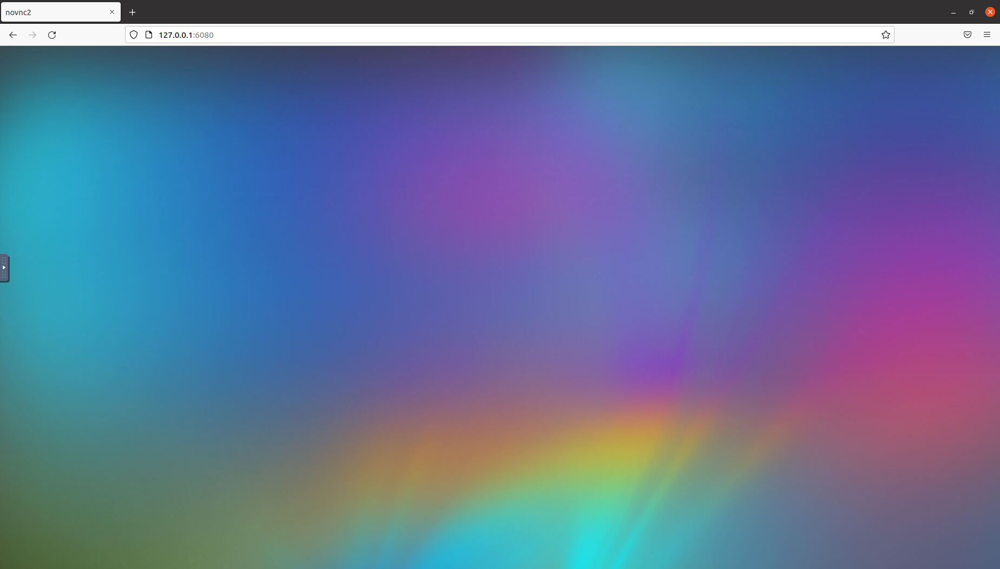

  - この本のDockerイメージで利用しているデスクトップ環境LXDEでは，画面の下辺にアイコンなどが表示されますので，このままでは操作できません．画面の左辺のタブをクリックしてnoVNCのメニューアイコンを表示します．  
    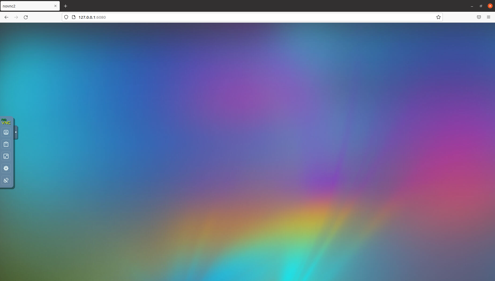

  - 「Fullscreen」のアイコンをクリックして，全画面表示にします．  
    

  - デスクトップ環境での操作は他と共通ですので，後述します．

  - 終わりたい場合は，ログアウトやサインアウトは要りません．noVNCのメニューを出し，「Disconnect」のアイコンをクリックします．ウェブブラウザ（のタブ）も閉じて構いません．

- Remminaを使う場合

  - Remmina（Ubuntu標準のリモートデスクトップクライアント）を起動します．  
    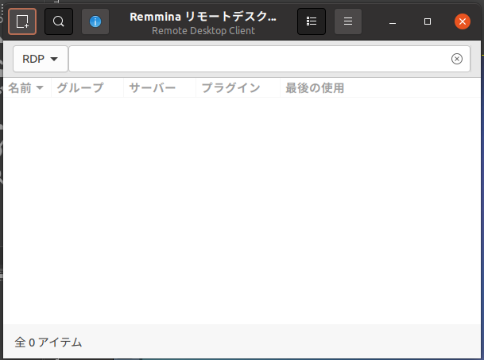

  - アドレス欄の左側をクリックしてプロトコルとして「VNC」を選び，アドレス欄に「127.0.0.1:15900」を入力しEnterキーを押します．  
    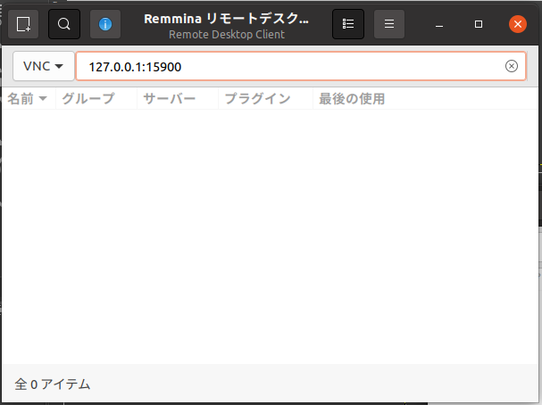

  - 別のウィンドウが現れ，以下のような内容が表示されればOKです．Remminaのデフォルトの設定では色数が256なのでグラデーションがきれいではありませんが，その設定は変更可能です．  
    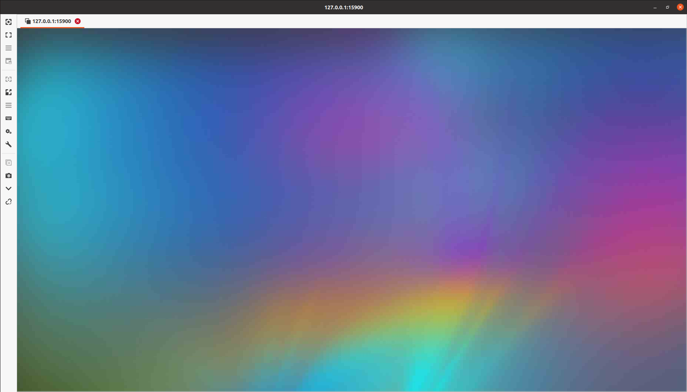

  - ウィンドウ左辺のアイコンの並びの中から「全画面モードのオン/オフ」をクリックして，全画面表示にします．  
    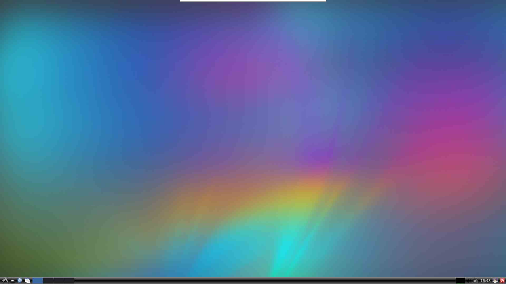

  - デスクトップ環境での操作は他と共通ですので，後述します．

  - 終わりたい場合は，ログアウトやサインアウトは要りません．画面の上辺にマウスカーソルを移動させて，RemminaのNCのメニューを出し，「切断」のアイコンをクリックします．最初のRemminaのウィンドウも閉じて構いません．  
    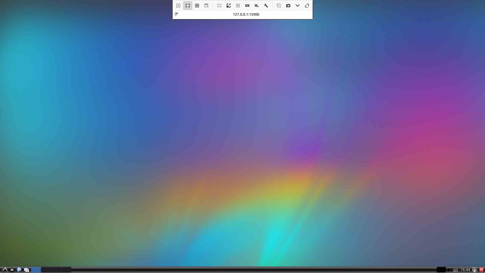

### コンテナの中断

デスクトップ環境を切断しただけでは，まだコンテナはメモリ上に存在しています．これを停止するには，別の端末ウィンドウを開いて，以下のように入力しEnterキーを押します．
```
docker stop ai_robot_book
```
`ai_robot_book`はコンテナを起動したときにコンテナに付けた名前です．

### コンテナの再開

停止したコンテナを再び使えるようにするには，端末ウィンドウで以下のように入力しEnterキーを押します．
```
docker start ai_robot_book
```
### コンテナの削除

コンテナ上での作業内容を全て破棄して，コンテナを削除するには，端末ウィンドウで以下のように入力しEnterキーを押します．
```
docker rm ai_robot_book
```

## Windowsの場合

### Dockerのインストール

[公式のドキュメント](https://docs.docker.jp/docker-for-windows/install.html)に従って「Docker Desktop for Windows」をインストールしてください．

### コンテナの起動

- 利用するコンピュータをインターネットに接続します．
- Docker Desktopを起動します．
- 起動コマンドが長いので，それを毎回入力しなくて済むようにバッチファイルを用意しました．
  - [ここからバッチファイルrun.bat](https://raw.githubusercontent.com/AI-Robot-Book/docker-ros2-desktop-ai-robot-book/ai-robot-book/run.bat)をダウンロードします．
  - ダウンロードしたファイルを適当なディレクトリに置きます．
  - エクスプローラでディレクトリを開き，アドレス欄に「cmd」と入力しEnterキーを押します．すると，そこをカレントディレクトリとしてコマンドプロンプトが起動します．

  - コマンドプロンプトのウィンドウ内で以下を入力して実行します．
    ```
    run
    ```
- 初めて起動する場合は，DockerHubからイメージ（約10GB）をプル（ダウンロード）するので，かなり時間がかかります．
- イメージのプルが済んだ後に，ずらずらとたくさんの文字が表示され，最後に以下のような内容が表示されたら，コンテナの準備完了です．
  ```
  2022-08-28 16:06:25,549 INFO success: lxpanel entered RUNNING state, process has stayed up for > than 1 seconds (startsecs)
  2022-08-28 16:06:25,549 INFO success: pcmanfm entered RUNNING state, process has stayed up for > than 1 seconds (startsecs)
  2022-08-28 16:06:25,549 INFO success: x11vnc entered RUNNING state, process has stayed up for > than 1 seconds (startsecs)
  2022-08-28 16:06:25,549 INFO success: novnc entered RUNNING state, process has stayed up for > than 1 seconds (startsecs)
  ```

### コンテナによるデスクトップ環境の利用

コンテナが提供するデスクトップ環境の利用方法は複数あります．

- ウェブブラウザを使う場合

  - ウェブブラウザを起動する．
  - アドレス欄に「`http://127.0.0.1:6080`」と入力しEnterキーを押します．
  - ブラウザ内に以下のような内容が表示されればOKです．  
    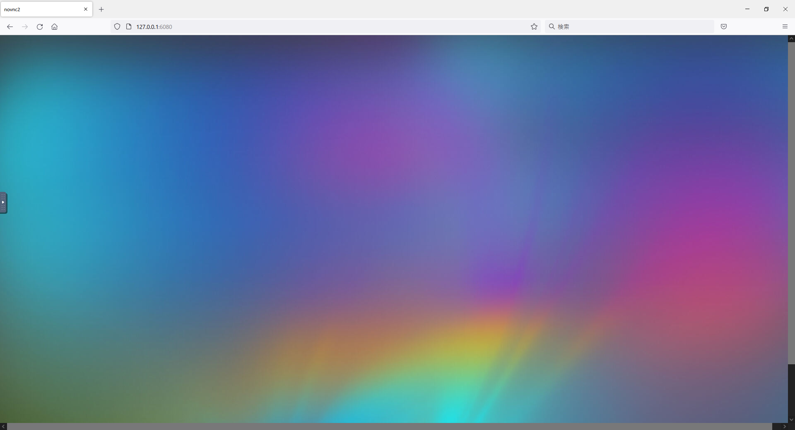


  - この本のDockerイメージで利用しているデスクトップ環境LXDEでは，画面の下辺にアイコンなどが表示されますので，このままでは操作できません．画面の左辺のタブをクリックしてnoVNCのメニューアイコンを表示します．  
    

  - 「Fullscreen」のアイコンをクリックして，全画面表示にします．  
    

  - デスクトップ環境での操作は他と共通ですので，後述します．

  - 終わりたい場合は，ログアウトやサインアウトは要りません．noVNCのメニューを出し，「Disconnect」のアイコンをクリックします．ウェブブラウザ（のタブ）も閉じて構いません．

- VNCビューアを使う場合

  - Windowsで使うことのできるVNCビューアには色々ありますが，ここではTightVNC Viewerを使います．[公式サイト](https://www.tightvnc.com/download.php)から「TightVNC for Windows」のインストーラをダウンロードし，インストールしてください．TightVNC Viewerはその中に含まれています．
  - Windowsのスタートメニューか検索からTightVNC Viewerを見つけ起動します．  
    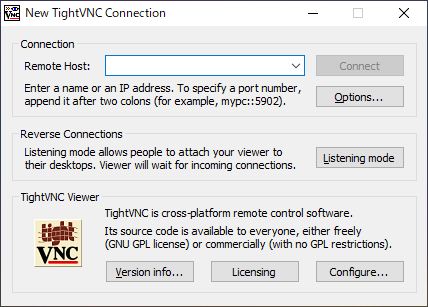

  - 「Remote Host」欄に「127.0.0.1:15900」を入力し，「Connect」をクリックします．  
    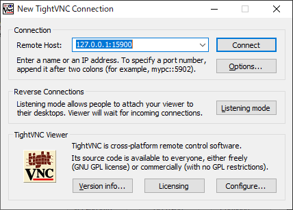

  - 別のウィンドウが現れ，以下のような内容が表示されればOKです．  
    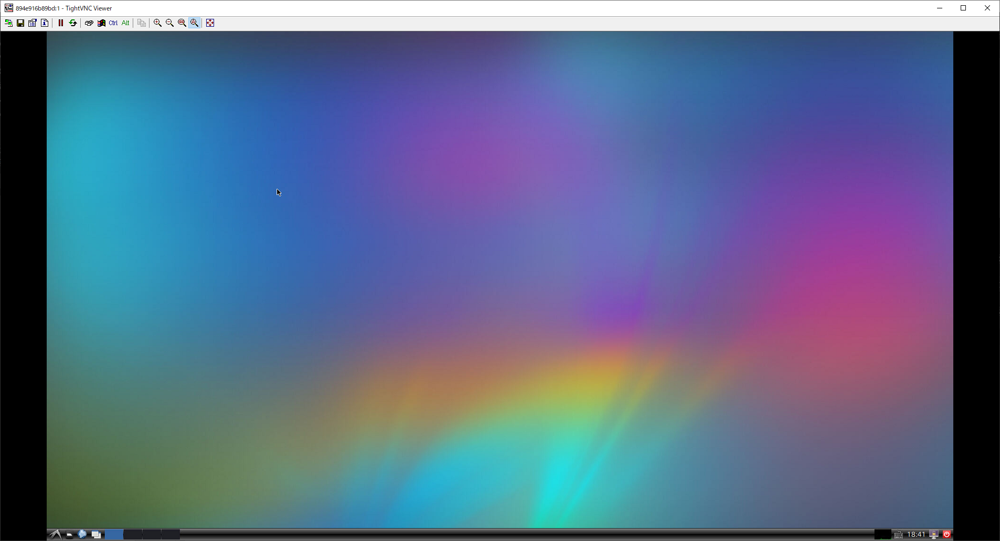

  - ウィンドウ上部のアイコンの並びの中から「Full screen」をクリックして，全画面表示にします．  
    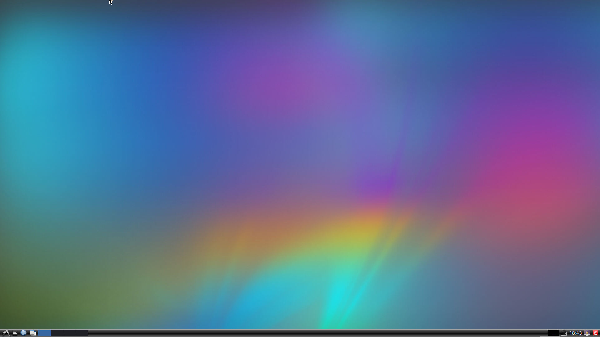

  - その後のパネルに説明されているように，全画面表示から戻るにはCtrl+Shift+Alt+Fの4個のキーを同時押しします．それを了解したら，パネルの「OK」をクリックします．

  - デスクトップ環境での操作は他と共通ですので，後述します．

  - 終わりたい場合は，ログアウトやサインアウトは要りません．全画面表示から戻り，ウィンドウの閉じるボタンをクリックします．

### コンテナの中断

デスクトップ環境を切断しただけでは，まだコンテナはメモリ上に存在しています．これを停止するには，Docker Desktopで操作します．Docker Desktopのウィンドウを開き，左側のメニューの「Containers」をクリックしてコンテナの一覧を表示します．一覧には「ai_robot_book」の1行だけが表示されているはずです．「ai_robot_book」の行の「STOP」のアイコンをクリックしてください．なお，「ai_robot_book」はコンテナを起動したときにコンテナに付けた名前です．  
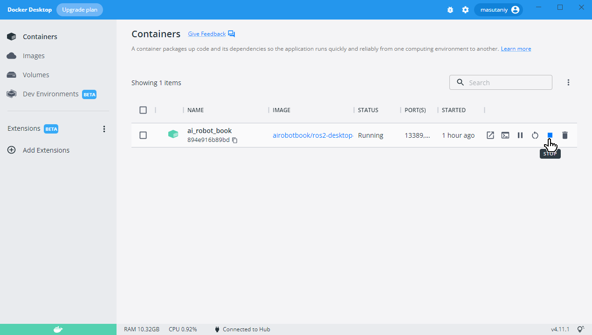

### コンテナの再開

停止したコンテナを再び使えるようにするには，Docker Desktopのウィンドウをを開き，「Containers」の中の「ai_robot_book」の行の「START」のアイコンをクリックしてください．  
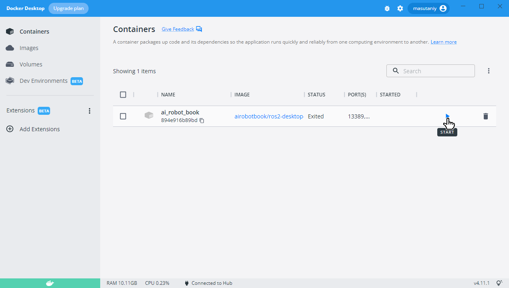

### コンテナの削除

コンテナ上での作業内容を全て破棄して，コンテナを削除するには，Docker Desktopのウィンドウをを開き，「Containers」の中の「ai_robot_book」の行の「DELETE」のアイコンをクリックしてください．  
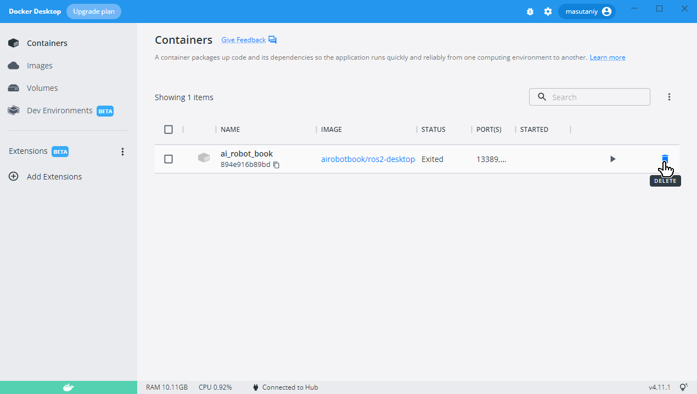

## デスクトップ環境の使い方（共通事項）

デスクトップ環境が使えるようになれば，ホストのOSやデスクトップ環境の利用方法に関わらず同じように操作できます．

### 利用例

- デスクトップの左下のLXDEのアイコンをクリック．
- メニューの中からシステムツール → Terminatorをクリック．  
  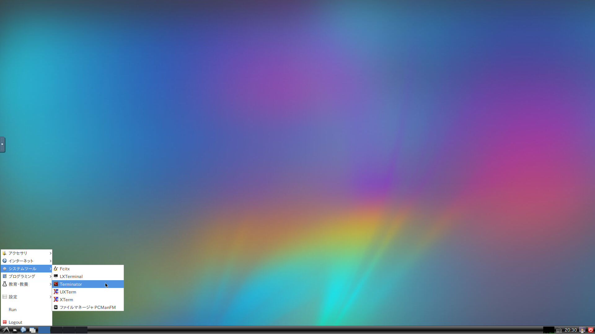

- Terminatorのウィドウの中で以下のように入力してEnterキーを押す．
  ```
  ros2 launch simple_arm_description display.launch.py
  ```
  

- 2つのウィンドウ「RViz」と「Joint State Publisher」が現れる．「Joint State Publisher」のウィンドウの大きさを調整して，スライダを使いやすくして，「RViz」のウィンドウに表示されているロボットアームを動かしてみる．  
  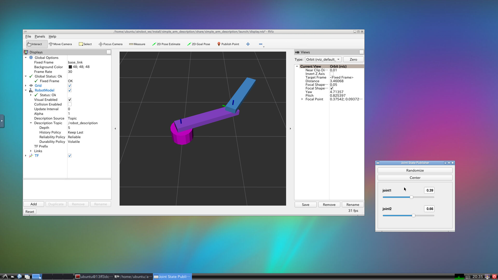

- このデモを終了するには，Terminatorのウィンドウを前面にして，Ctrl+Cキーを押す．

### 主な機能

- デスクトップ環境
  - Ubuntuの標準とは異なり，LXDEという軽量でシンプルなデスクトップ環境を使っています．

- ウェブブラウザ
  - Firefoxをインストール済みです．
  - メニュー： インターネット → Firefox ウェブ・ブラウザ 

- 端末ウィンドウ
  - いくつかの端末ウィンドウをインストールしてありますが，この本の中でも紹介しているようにTerminatorがお勧めです．
  - メニュー： システムツール → Terminator

- 日本語化
  - 言語やタイムゾーンやフォントは日本語に設定してあります．
  - Mozcによる日本語入力も可能です．

- テキストエディタ
  - VS Code（Visual Studio Code）を完全オープンソース化して再配布が可能なVSCodiumをインストール済みです．
  - 日本語とPythonのプラグインをインストールしてあります．
  - VSCodiumを初めて起動したときは日本語化されていませんが，2回目からは日本語化されます．

## ハードウェアの使い方

DockerのホストとしてUbuntu Linuxを使っている場合は，Dockerのコンテナからホストのハードウェアを利用できます．

### 音声入出力

- ホスト側のPuluseAudioによる音声入出力をソケット共有によりコンテナ側から利用できます．

### USB接続の機器

- このDockerコンテナは，`--privileged`オプションを付けて起動していますので，ホストの
`/dev`以下のデバイスファイルをコンテナから参照できます．
- USB機器のデバイスファイルは，機器を接続した後にデバイスファイルができるため，利用するハードウェア機器はコンテナを起動するより前にホストに接続してください．

## ヘルプ

Q&Aなどを追加する予定です．

## Windows リモートデスクトップ接続の利用（未完成）

Windows標準の「リモートデスクトップ接続」でこの本の提供するデスクトップ環境を利用することもできます．この方法を使うと，Windowsでも音声入力が可能です．しかし，一部に不具合があることがわかっています．

- [Windowsの場合](#windowsの場合)と全く同じやり方でコンテナを起動します．
- Windouwsのスタートメニューか検索から「リモートデスクトップ接続」を見つけて起動します．

- リモートデスクトップ接続の「コンピュータ」欄に「127.0.0.1:13389」と入力し「接続」をクリックします．  
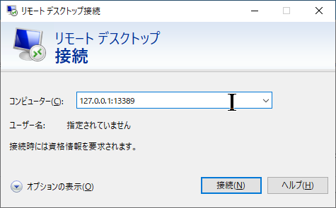

- 「このリモートコンピューターのIDを識別できません。接続しますか？」というウィンドウが現れたら「はい」をクリックします．
- 別のウィンドウが現れ，xrdpのログインパネルが表示されますので，「username」欄に「ubuntu」，「password」欄に「ubuntu」（伏字になります）と入力し「OK」をクリックします．  
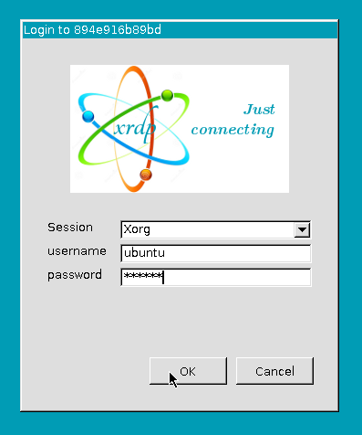

- ウインドウのタイトルバーをダブルクリックすると，全画面表示になります．
- このデスクトップ環境の音声入出力を確認しましょう．
  - 左下のLXDEのアイコンをクリックし，メニューの「インターネット」→「Firefoxウェブ・ブラウザ」をクリックします．
  - FirefoxでYuuTubeのサイトを開き，動画を再生して音声出力ができることを確認します．
  - YouTubeのページ上部のSearch欄の右側にあるマイクのアイコンをクリックし，「xrdp source」に対して「Allow」をクリックしてから，音声入力ができることを確認します．
- 2022年8月28日現在，この本の第3章の音声認識のノードがうまく動作していません．Pythonのpyaoudioモジュールを利用する際に，音声入力がうまくいかないことを確認しています．
- 終わりたい場合は，ログアウトやサインアウトは要りません．マウスカーソルをウィンドウの上辺に移動させると，リモートデスクトップ接続のタイトルが表示されますので，閉じるボタンをクリックします．


## 著者

升谷 保博

## 履歴

- 2022-08-28: ドキュメントの整備

## 参考文献

- 今のところなし．
